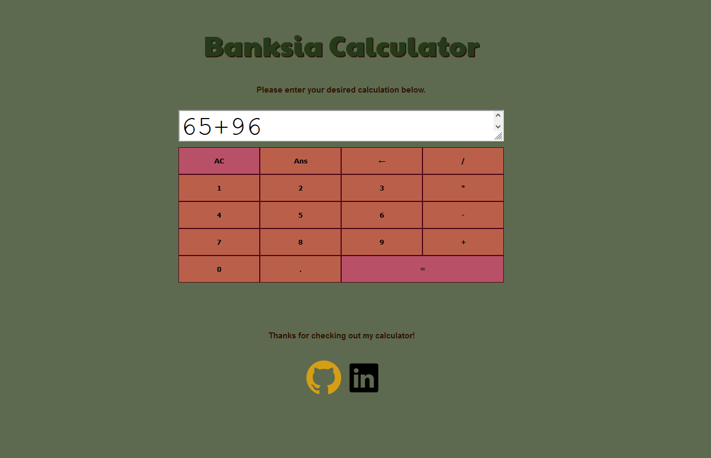

# Banksia Calculator Project

A calculator project designed in HTML, CSS and JavaScript. I completed the initial version of this project during my time at \_nology. This is a remake I completed in my own time.

## Design

As I made this project as part of my initial suite as part of Nology, I based the colouring and theme from Australian flora. In this case, I based the colouring off a banksia, via this colour palette.
https://i.pinimg.com/originals/41/b2/e9/41b2e9f8680d4a23bfde778cdca1e865.jpg

We were advised to base our calculators on an existing calculator we found online, so I chose this simple calculator. I swapped out the +- toggle with the Ans option.
https://kidssearch.com/KidsCalculator.html

### Responsiveness

The minimum dimensions for this website are 250 width x 600 height.
This is well below the iPhone 11 Pro at 375x812 and the Galaxy S10 at 360 x 760.

## Functionality

This calculator works on a simple left-to-right basis, calculating as it goes. This means that order of operations are not (yet) implemented. Every time an operator button is clicked, it calculates the existing equation, then stores the output in an array.

Edge cases:

-   When dividing by 0, the calculator returns "error".
-   When adding on to an existing equals (e.g. 5+6=11 and writing an additional 1, making the number 111), this works as if the user had typed 111.
-   Multiple decimal points cannot be added if a number already contains a decimal point.
-   Two operators cannot be placed next to one another.
-   Only one 0 is permitted at the start of the equation.

## Reasons for remaking

I found my previous calculator project to be somewhat buggy, so I decided to remake it to improve my skills.

It uses the same colour palette as the previous calculator, with the style of a banksia, but I decided to add more squared-off buttons that were closer together to keep with the style of more modern calculator websites.

## To fix

-   Order of operations
-   ability to add a - (minus) at the start of an equation to allow for negative numbers
